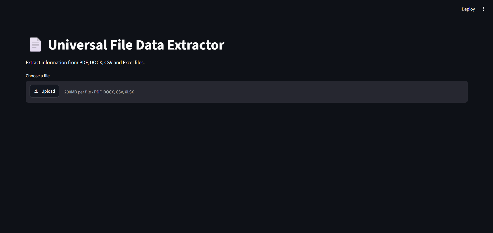
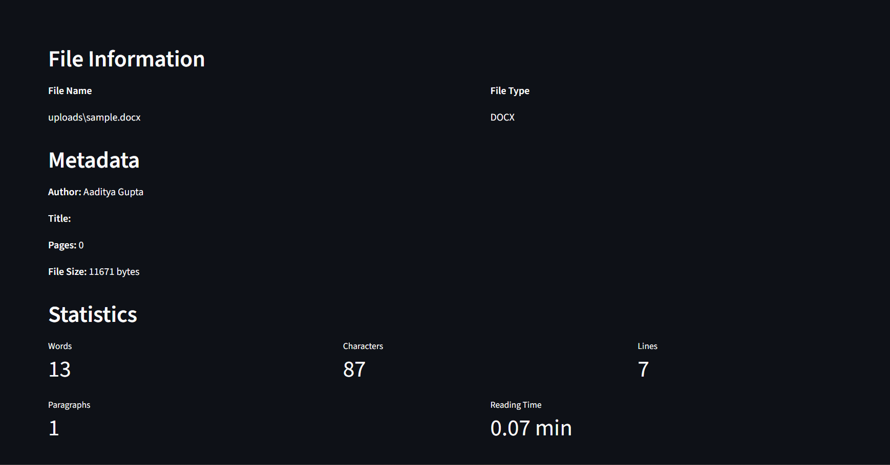
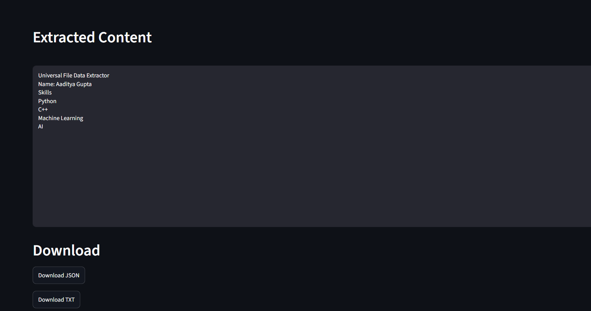
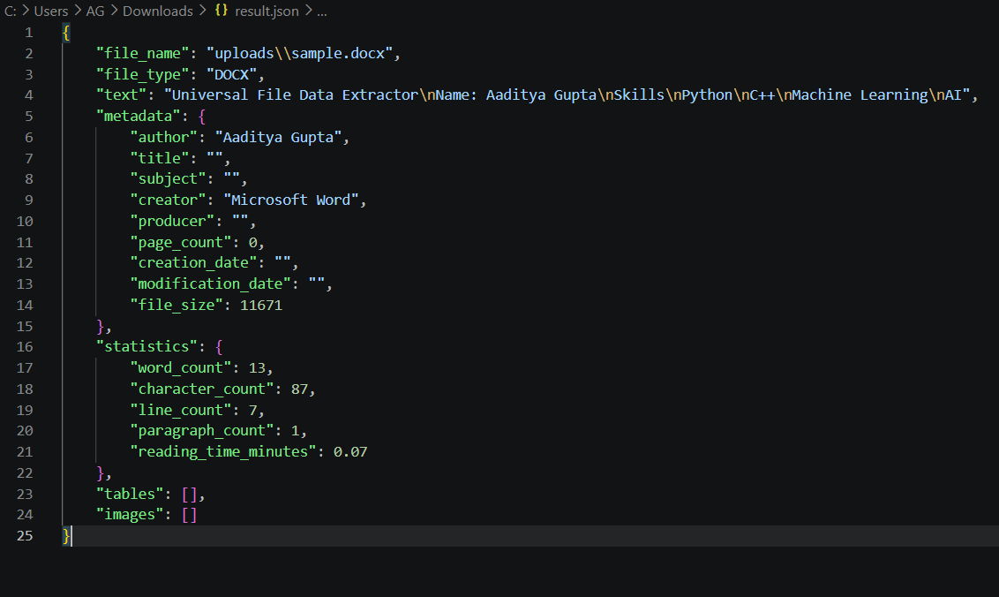
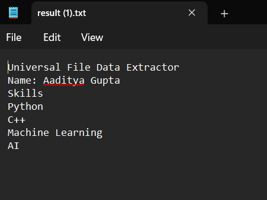

# 📄 Universal File Data Extractor

A professional Python application that extracts structured information from multiple document formats using a modular and object-oriented architecture.

---

## 📌 Overview

Universal File Data Extractor is a Python-based application that automatically detects the uploaded file type, selects the appropriate extractor, and returns structured information such as:

- Extracted Text
- Metadata
- File Statistics
- Structured Table Data (CSV & Excel)

The application supports both a **Command Line Interface (CLI)** and a **Streamlit-based Web Interface**.

---

## ✨ Features

- 📄 PDF Text Extraction
- 📝 DOCX Text Extraction
- 📊 CSV Data Extraction
- 📈 Excel (.xlsx) Data Extraction
- 📋 Automatic File Type Detection
- 🔀 Dynamic Extractor Routing
- 📊 File Statistics Generation
- 📑 Metadata Extraction
- 💾 Export Results to JSON
- 📄 Export Results to TXT
- 🌐 Streamlit Web Interface
- 📝 Application Logging
- 🏗 Modular Object-Oriented Architecture

---

## Screenshots

### Home Screen



---

### Extraction Result 


---
### Extraction Result 


---

### JSON Output



---

### TXT Output


---


## 📂 Supported File Types

| File Type | Supported |
|-----------|-----------|
| PDF | ✅ |
| DOCX | ✅ |
| CSV | ✅ |
| Excel (.xlsx) | ✅ |

---

## 🏗 Project Architecture

```
Universal-File-Data-Extractor/
│
├── core/
│   ├── detector.py
│   ├── router.py
│   └── app_logger.py
│
├── extractors/
│   ├── base_extractor.py
│   ├── pdf_extractor.py
│   ├── docx_extractor.py
│   ├── csv_extractor.py
│   └── excel_extractor.py
│
├── models/
│   ├── extraction_result.py
│   ├── metadata.py
│   └── statistics.py
│
├── utils/
│   ├── exporter.py
│   ├── metadata.py
│   └── statistics.py
│
├── uploads/
├── outputs/
├── logs/
├── tests/
│
├── app.py
├── streamlit_app.py
├── requirements.txt
├── README.md
└── LICENSE
```

---

## ⚙ Technologies Used

- Python 3.11
- Streamlit
- Pandas
- PyMuPDF
- python-docx
- OpenPyXL
- Dataclasses
- Logging
- Object-Oriented Programming (OOP)

---

## 🚀 Installation

### Clone Repository

```bash
git clone <https://github.com/Aaditya-735/Universal-File-Data-Extractor.git>
```

### Move into Project

```bash
cd Universal-File-Data-Extractor
```

### Create Virtual Environment

```bash
py -3.11 -m venv .venv
```

### Activate Environment

Windows

```bash
.venv\Scripts\activate
```

### Install Requirements

```bash
pip install -r requirements.txt
```

---

## ▶ Run Terminal Version

```bash
python app.py
```

---

## 🌐 Run Streamlit Version

```bash
streamlit run streamlit_app.py
```

---

## 📊 Outputs

The application automatically generates:

- outputs/result.json
- outputs/result.txt
- logs/application.log

---

## 🧪 Testing

Testing has been completed for:

- PDF Extraction
- DOCX Extraction
- CSV Extraction
- Excel Extraction
- Streamlit UI
- Export Module

See:

```
tests/test_report.md
```

---

## 📈 Future Enhancements

Future versions may include:

- OCR for scanned PDFs
- Image Extraction
- JSON Support
- XML Support
- AI-powered Document Summarization
- Keyword Extraction
- Multi-language Support

---

## 👨‍💻 Author

**Aaditya Gupta**

B.Tech Artificial Intelligence & Data Science

Python Developer | AI Enthusiast | Machine Learning Learner

---

## 📜 License

This project is licensed under the MIT License.